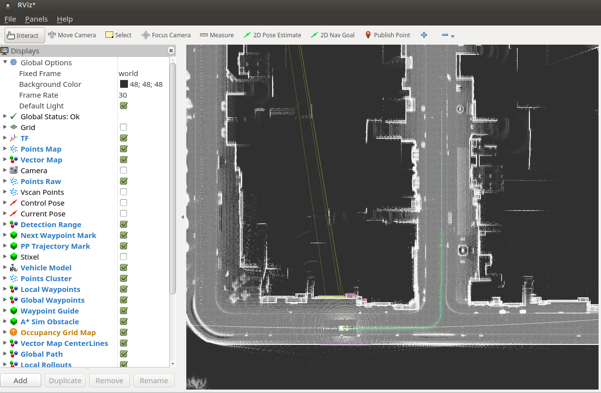

# Important
**- This repository is custom version of carla-autoware and ros-bridge for CARLA 0.9.13**

# Autoware in Carla
Integration of AutoWare AV software with the CARLA simulator

## Requirements

- ~~ROS kinetic~~
- ~~Autoware (tested with 1.12.0)~~
- ~~CARLA 0.9.6~~
- ROS melodic
- Autoware (tested with 1.15.0)
- CARLA 0.9.13

